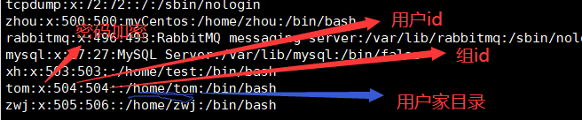
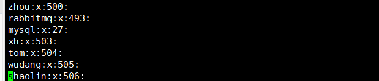

# Linux

### 安装

**在VMware上安装Linux虚拟机**

虚拟机网络配置

- NAT（推荐）
- 桥接模式
- 仅主机模式

### 文件目录

Linux下最顶级目录只有一个，即`/`，根目录下的结构如下：

`/bin`：是binary的缩写，这个目录存放着最经常使用的命令

`/sbin`：s是super user的意思，这里存放的是系统管理员专用的命令

`/home`：存放普通用户的主目录，在linux中每个用户都有一个自己的目录，目录名一般是该用户的账号名

`/root`：该目录为系统管理员的主目录，非root用户没有权限访问

`/lib`：系统开机所需要的最基本的动态连接共享库，其作用类似于Windows里的DLL文件。几乎所有的应用程序都需要用到这些共享库。

`/lost+found`：这个目录一般是空的，当系统异常关机时，这里会存放一些文件

`/etc`：所有的系统管理所需要的配置文件和子目录，例如mysql的配置文件my.conf

`/usr`：这是一个非常重要的目录，用户的很多应用程序和文件都存放在这里，类似于windows下的program files目录

`boot`：存放的是启动linux时使用的一些核心文件，包括连接文件以及镜像文件

`/proc`： 这个目录是一个虚拟的目录，它是系统内容的映射，访问这个目录来获取系统信息

`/srv`：service的缩写，该目录存放一些服务启动之后需要提取的数据

`/sys`：这是linux2.6内核之后的一个很大的变化，该目录安装了2.6内核中新出现的一个文件系统sysfs

`/tmp`：这个目录用来存放一些临时文件

`/dev`：类似于windows的设备管理器，将所有的硬件以文件的形式存储

`/media`：linux系统会自动识别一些设备，例如U盘、光驱等，当识别后，linux会把识别的设备挂载到这个目录下

`/mnt`：系统提供该目录是为了让用户临时挂载别的文件系统，例如windows上面的d盘

`/opt`：放置软件安装包

`/usr/local`：软件安装完之后存放的目录，一般是通过编译源码方式安装的软件

`/var`：存放不断扩充的内容，习惯上将经常被修改的文件或目录放在var目录下。包括各种日志文件

`/selinux`：是一种安全子系统

### 使用vi

**vi和vim的三种模式**

1.

2.

3.

**快捷键**

1.复制粘贴  **p**，如果复制当前行向下的5行，可以输入**5p**

2.删除 **dd**，如果删除当前行向下的5行，输入**5dd**

3.在文件中查找，例如查找hello，可以输入 **/hello**，再按 **n**查找下一个

4.设置文件的行号  **:set nu** ，取消行号**:set nonu**

5.快速到达文档末尾 `G` ， 快速跳到文档开头 `gg`

6.在文件中撤销刚输入的内容 `u`

7.编辑文档时，快速将光标移动到某一行

- 第一步，显示行号  :set nu
- 第二步，输入行号，比如20
- 第三步，shift+g快捷键

***

### 开机、重启和用户登录注销

**开机、重启**

shutdown

​	shutdown -h now：表示立即关机

​    shutdown -h 1：表示1分钟后关机

​	shutdown -r now：立即重启

reboot 重启系统

halt  立刻关机，相当于shutdown -h now

sync：把内存的数据同步到磁盘

> Linux sync命令用于数据同步,sync命令是在关闭Linux系统时使用的。
>
> Linux 系统中欲写入硬盘的资料有的时候为了效率起见，会写到 filesystem buffer 中，这个 buffer 是一块记忆体空间，如果欲写入硬盘的资料存于此 buffer 中，而系统又突然断电的话，那么资料就会流失了，sync 指令会将存于 buffer 中的资料强制写入硬盘中。

**用户登录和注销**

注销：使用logout命令

注意：su与su -都是用来切换用户的命令，简单说它们之间的区别就是：su -切换的干净彻底，而su
切换用户却拖泥带水。
#### su
su username，切换到指定用户，但是当前目录不会变化，环境变量还是上一个用户的环境变量。
#### su -
su - username，切换到指定用户，当前目录即刻切换成指定用户的家目录，即~，环境变量
即刻切换到指定目录的环境变量。

***

### 用户管理

Linux系统是一个多用户多任务的操作系统，任何一个要使用系统资源的用户，都必须首先向系统管理员申请一个账号，然后以这个账号的身份进入系统。

Linux的用户至少属于一个组。

**添加用户**

1.useradd 用户名

```bash
[root@localhost ~]# useradd tom
```

添加用户tom，默认新建的用户家目录在/home下，默认所属组跟用户名相同

进入/home下查看

```bash
[root@localhost ~]# cd /home
[root@localhost home]# ll
total 8
drwx------.  4 tom  tom  4096 Sep 22 04:14 tom
drwx------. 30 zhou zhou 4096 Sep 22 02:11 zhou
[root@localhost home]# 
```

2.useradd  -d  指定目录  用户名

```bash
[root@localhost home]# useradd -d /home/test xh
```

**修改密码**

passwd 用户名

```bash
[root@localhost home]# passwd xh
Changing password for user xm.
New password: 
BAD PASSWORD: it is WAY too short
BAD PASSWORD: is too simple
Retype new password: 
passwd: all authentication tokens updated successfully.
```

密码设置太简单，会有警告

**删除用户**

userdel  用户名

两种情况：

1.删除用户，但保留用户家目录

例子，删除上面创建的tom用户

```bash
[root@localhost home]# ll
total 12
drwx------.  4  502  502 4096 Sep 22 04:22 test
drwx------.  4 tom  tom  4096 Sep 22 04:14 tom
drwx------. 30 zhou zhou 4096 Sep 22 02:11 zhou
[root@localhost home]# userdel tom
[root@localhost home]# ll
total 12
drwx------.  4  502  502 4096 Sep 22 04:22 test
drwx------.  4  501  501 4096 Sep 22 04:14 tom
drwx------. 30 zhou zhou 4096 Sep 22 02:11 zhou
[root@localhost home]# 
```

查看/home目录下，tom的家目录还保留着

2.删除用户及其家目录

userdel  -r  tom

> 删除用户时，通常会保留其家目录。


**查看**

使用id命令

```bash
[root@localhost home]# id zhou
uid=500(zhou) gid=500(zhou) groups=500(zhou)
[root@localhost home]# id root
uid=0(root) gid=0(root) groups=0(root)
```

查看当前用户

whoami或者who am i

```bash
[root@localhost home]# whoami
root

```

**切换用户**

在linux上执行某些操作时，提示当前用户的权限不够，这时我们可以通过`su `命令来切换到高权限的用户，比如root。

```bash
[root@localhost home]# su tom
[tom@localhost home]$ cd /root
bash: cd: /root: Permission denied
[tom@localhost home]$ exit
exit
[root@localhost home]# 

```


从权限低的用户切换到高权限的用户，需要输入密码

***

### 组管理

用户组：类似于角色，linux中对有共性的多个用户进行统一管理

**增加组**

groupadd  组名

**删除组**

groupdel  组名

**增加用户时分配组**

useradd  -g  用户组 用户名

```bash
[root@localhost home]# groupadd wudang
[root@localhost home]# useradd -g wudang zwj
[root@localhost home]# id zwj
uid=505(zwj) gid=505(wudang) groups=505(wudang)
[root@localhost home]# 
```

上述例子，先创建一个wudang组，再创建一个zwj用户并为他分配到wudang组。

**修改用户的组**

usermod  -g  用户组  用户名

```bash
[root@localhost home]# groupadd shaolin
[root@localhost home]# usermod -g shaolin zwj
[root@localhost home]# id zwj
uid=505(zwj) gid=506(shaolin) groups=506(shaolin)
```

**用户和组相关的文件**

1./etc/passwd文件：用户的配置文件，记录用户的各种信息



2./etc/shadow文件：口令的配置文件，存放用户的加密密码

3./etc/group文件：组的配置文件

每行的含义：组名：口令：组id：组内用户列表



### linux的运行级别


### linux的常用命令

#### 帮助命令

help

man

#### 文件目录类

pwd

ls
